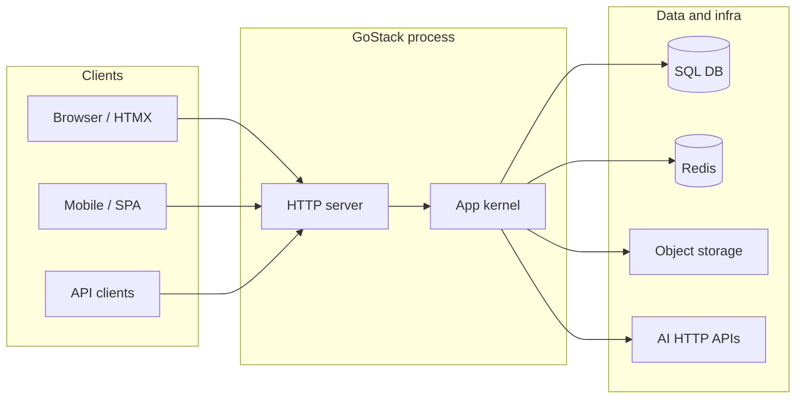
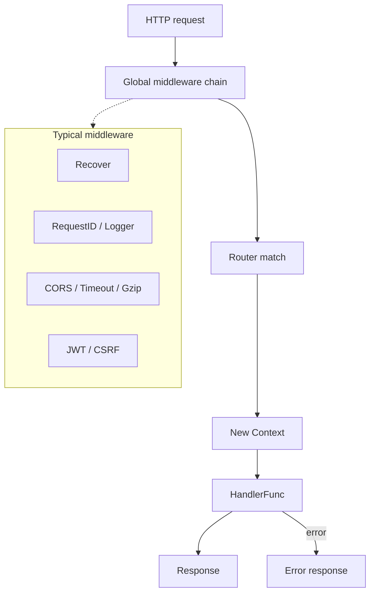
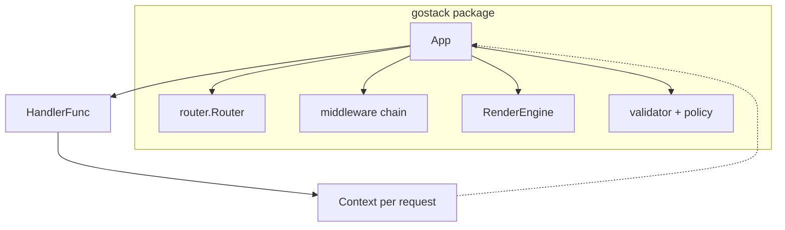
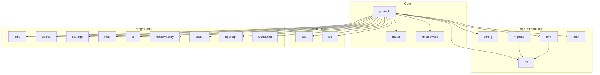
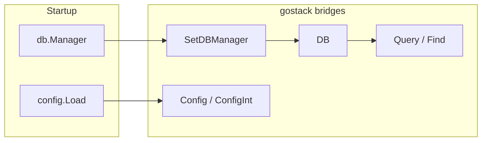
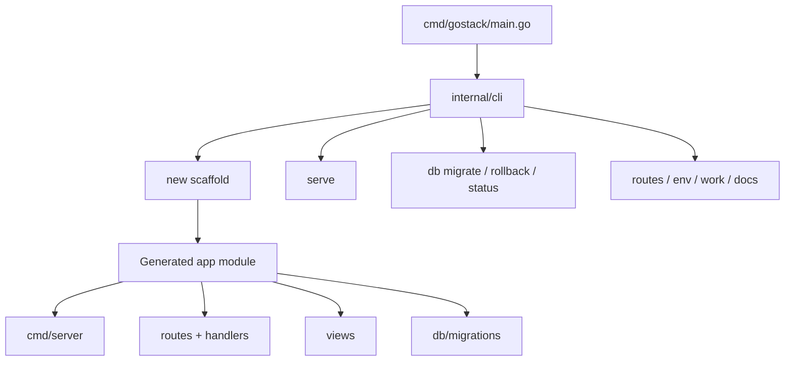
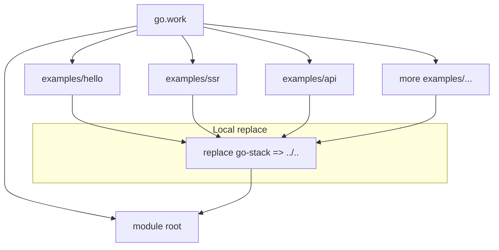
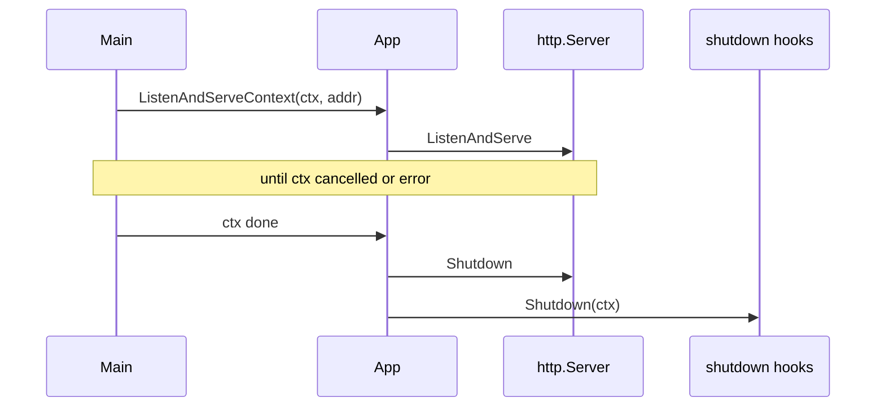

# GoStack architecture

This document is a **structural overview** of the framework as implemented in this repository. For product intent and feature depth, see [PRD.md](../PRD.md).

---

## 1. System context

How a typical GoStack deployment sits next to clients and backing services.

---

## 2. HTTP request path

Incoming requests pass through **global middleware**, then the **router** dispatches to a **handler**. Handlers receive a `*Context` and return `error`; the kernel maps failures to HTTP responses.

**Route groups** wrap handlers with **group-local** middleware before the handler runs (same `Context` model).

---

## 3. Application kernel

Core types in package `github.com/rohitdas13595/go-stack` and how they relate.

- **`App`** — Registers routes, groups, and resources; owns global middleware; optional renderer and validation/policy hooks.
- **`Context`** — Per-request wrapper: `Param`, `Query`, `Bind`, `JSON`, `Render`, `RenderPartial`, `User`, `Authorize`, etc.
- **`RenderEngine`** — `html/template` over a filesystem `fs.FS` (e.g. `views/`).

---

## 4. Package map

Major **library packages** under the module (simplified dependency view).

Handlers usually import **`gostack`** and **`middleware`**; data access uses **`db`**, **`migrate`**, **`orm`**, or **`gostack.DB()` / `gostack.Query`** when the DB manager is registered.

---

## 5. Bridges and globals

Some capabilities are configured once at startup and reached through **package-level helpers** (optional sugar; you can also pass dependencies explicitly in your own code).

- **`SetDBManager`** — Registers named pools; **`DB()`** returns `*sql.DB` for ORM and raw SQL.
- **`config.Global()`** — Filled by **`config.Load`**; **`gostack.Config*`** reads dotted paths.

---

## 6. CLI and generated apps

The **`gostack`** binary is a thin entrypoint; commands live under **`internal/cli`**.

Generated applications depend on the **same module** `github.com/rohitdas13595/go-stack` (often with a **`replace`** to a local checkout during development).

---

## 7. Examples workspace

Local **examples** are separate **Go modules** in `examples/*`, each replacing the framework path so builds work without publishing.

---

## 8. Shutdown and server lifecycle

`App.ListenAndServe` uses the standard library `http.Server`. **`ListenAndServeContext`** ties server shutdown to a context and runs **`App.Shutdown`** hooks (registered by integrations that need cleanup).

---

## Reading order

1. **`gostack.go`** — routing, groups, `ServeHTTP`, `ListenAndServe*`
2. **`context.go`** — request API surface
3. **`router/router.go`** — matching semantics
4. **`middleware/middleware.go`** — common middleware
5. **`internal/cli/`** — how scaffolding and DB commands work

For file-level detail, see [DEVELOPMENT.md](DEVELOPMENT.md).
